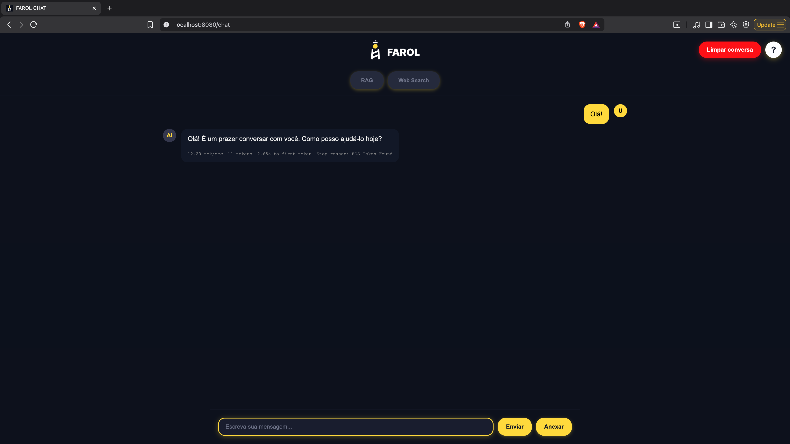

# Projeto farol. RAG com LLMs Locais (Go + Ollama + SearxNG)

Uma demonstração prática de **RAG (Retrieval-Augmented Generation)** para validar as capacidades de **modelos locais (LLMs)**.  
A aplicação utiliza três serviços em containers: **API em Go**, **Ollama** e **SearxNG** para busca web.



## Funcionalidades

- **RAG para testes**: recuperação de contexto e geração de resposta
- **LLM local via Ollama**: inferência sem dependência de API externa
- **Busca web com SearxNG**: enriquecimento de contexto em tempo real
- **API em Go**: orquestração de prompts, recuperação e resposta
- **Deploy simples**: subir tudo com um único comando

## Quick Start

### Pré-requisitos
- Docker
- Docker Compose
- Mínimo recomendado: 16GB RAM

### Instalação

```bash
docker compose up
```

Na primeira execução, o modelo local do Ollama pode ser baixado automaticamente.

**Acesso:** http://localhost:8080/chat

## Arquitetura

```text
Frontend (localhost:3000)
        ↓ HTTP
API (Go)
   ├── Orquestração RAG
   ├── Consulta ao Ollama (LLM local)
   └── Consulta ao SearxNG (busca web)
```

## Stack Tecnológica

**Backend/API:** Go  
**LLM Local:** Ollama  
**Busca Web:** SearxNG  
**Infra:** Docker Compose

## Estrutura do Projeto

```text
├── api/                  # Serviço em Go
├── docker-compose.yml    # Orquestração dos containers
├── assets/               # Imagens/screenshot
└── README.md
```

## Objetivo do Projeto

Este projeto é voltado para **testar capacidades de modelos locais** em cenários de RAG, incluindo:

- qualidade de resposta com contexto externo
- uso de busca web para atualização de informações
- latência e custo operacional local
- comportamento da API em fluxos de teste

## Troubleshooting

**A aplicação não abre em localhost:8080/chat ?**  
Verifique se todos os containers estão ativos:
```bash
docker compose ps
```

**Modelo não responde?**  
Confira logs do Ollama:
```bash
docker compose logs -f ollama
```

**Busca web sem resultados?**  
Confira logs do SearxNG:
```bash
docker compose logs -f searxng
```

**Erro na API Go?**  
```bash
docker compose logs -f api
```

## Desenvolvimento

```bash
# Subir ambiente completo
docker compose up

# Subir em background
docker compose up -d

# Parar ambiente
docker compose down
```

## Licença

MIT

